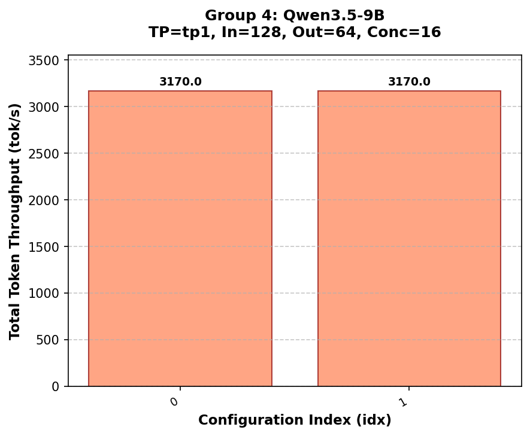

# Benchmark Results Report

**Generated:** 2026-04-09 12:45:28

## SLO Criteria

- No SLO thresholds applied
- Data Policy: remove_min_max

## Group Results

### Group 0

| Attribute | Value |
|-----------|-------|
| **Model** | Qwen3.5-9B |
| **Deploy Method** | tp1 |
| **Template ID** | 1 |
| **Input Length** | 64 |
| **Output Length** | 32 |
| **Max Concurrency** | 16 |
| **Image Size/Count** | 448x448/1 |

#### Results

| idx | Throughput (tok/s) | TTFT (ms) | TPOT (ms) |
| --- | --- | --- | --- |
| 0 | 3170.0 | 0.0 | 24.2 |
| 1 | 3170.0 | 0.0 | 24.2 |

#### Configuration Details

| idx | Env Opt | Server Args Opt | Additional Options |
| --- | --- | --- | --- |
| 0 | (none) | (none) | --context-length 262144 --reasoning-parser qwen3 |
| 1 | (none) | --decode-attention-backend flashinfer | --context-length 262144 --reasoning-parser qwen3 |

### Group 1

| Attribute | Value |
|-----------|-------|
| **Model** | Qwen3.5-9B |
| **Deploy Method** | tp1 |
| **Template ID** | 1 |
| **Input Length** | 64 |
| **Output Length** | 32 |
| **Max Concurrency** | 32 |
| **Image Size/Count** | 448x448/1 |

#### Results

| idx | Throughput (tok/s) | TTFT (ms) | TPOT (ms) |
| --- | --- | --- | --- |
| 0 | 3330.0 | 0.0 | 24.2 |
| 1 | 3330.0 | 0.0 | 24.2 |

#### Configuration Details

| idx | Env Opt | Server Args Opt | Additional Options |
| --- | --- | --- | --- |
| 0 | (none) | (none) | --context-length 262144 --reasoning-parser qwen3 |
| 1 | (none) | --decode-attention-backend flashinfer | --context-length 262144 --reasoning-parser qwen3 |

### Group 2

| Attribute | Value |
|-----------|-------|
| **Model** | Qwen3.5-9B |
| **Deploy Method** | tp1 |
| **Template ID** | 1 |
| **Input Length** | 64 |
| **Output Length** | 32 |
| **Max Concurrency** | 64 |
| **Image Size/Count** | 448x448/1 |

#### Results

| idx | Throughput (tok/s) | TTFT (ms) | TPOT (ms) |
| --- | --- | --- | --- |
| 0 | 3650.0 | 0.0 | 24.2 |
| 1 | 3650.0 | 0.0 | 24.2 |

#### Configuration Details

| idx | Env Opt | Server Args Opt | Additional Options |
| --- | --- | --- | --- |
| 0 | (none) | (none) | --context-length 262144 --reasoning-parser qwen3 |
| 1 | (none) | --decode-attention-backend flashinfer | --context-length 262144 --reasoning-parser qwen3 |

### Group 3

| Attribute | Value |
|-----------|-------|
| **Model** | Qwen3.5-9B |
| **Deploy Method** | tp1 |
| **Template ID** | 1 |
| **Input Length** | 128 |
| **Output Length** | 64 |
| **Max Concurrency** | 8 |
| **Image Size/Count** | 1280x1280/1 |

#### Results

| idx | Throughput (tok/s) | TTFT (ms) | TPOT (ms) |
| --- | --- | --- | --- |
| 0 | 3090.0 | 0.0 | 24.2 |
| 1 | 3090.0 | 0.0 | 24.2 |

#### Configuration Details

| idx | Env Opt | Server Args Opt | Additional Options |
| --- | --- | --- | --- |
| 0 | (none) | (none) | --context-length 262144 --reasoning-parser qwen3 |
| 1 | SGLANG_VISION_ATTN_FP8=1 | (none) | --context-length 262144 --reasoning-parser qwen3 |

### Group 4

| Attribute | Value |
|-----------|-------|
| **Model** | Qwen3.5-9B |
| **Deploy Method** | tp1 |
| **Template ID** | 1 |
| **Input Length** | 128 |
| **Output Length** | 64 |
| **Max Concurrency** | 16 |
| **Image Size/Count** | 1280x1280/1 |

#### Results

| idx | Throughput (tok/s) | TTFT (ms) | TPOT (ms) |
| --- | --- | --- | --- |
| 0 | 3170.0 | 0.0 | 24.2 |
| 1 | 3170.0 | 0.0 | 24.2 |

#### Configuration Details

| idx | Env Opt | Server Args Opt | Additional Options |
| --- | --- | --- | --- |
| 0 | (none) | (none) | --context-length 262144 --reasoning-parser qwen3 |
| 1 | SGLANG_VISION_ATTN_FP8=1 | (none) | --context-length 262144 --reasoning-parser qwen3 |
